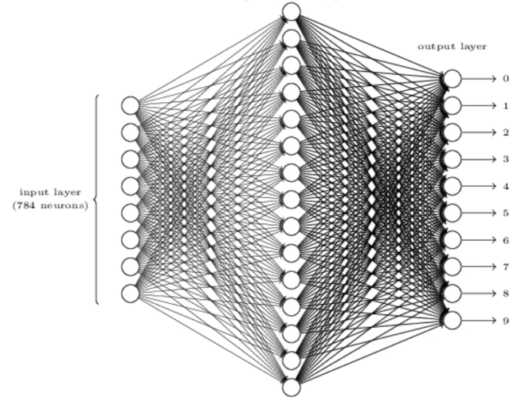
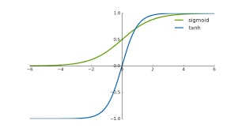

# Neural Net Implementation for Handwritten Digit Recognition in C++ (Scaled Hyperbolic Tangent & MNIST)

## [Background](https://arxiv.org/pdf/1003.0358)

## Implementation

| ID | Architecture                 | Best Validation Error (%) | Test Error (%) | Training Time (hours) | Number of Weights (Millions) | Implemented |
|----|------------------------------|---------------------------|----------------|------------------------| ------------------------| ------------------------------|
| 1  | 1000, 500, 10                | 0.49                      | 0.44           | 23.4                  | 1.34                         | ✅                         |
| 2  | 1500, 1000, 500, 10          | 0.46                      | 0.40           | 44.2                  | 3.26                         | ❌                         |
| 3  | 2000, 1500, 1000, 500, 10    | 0.41                      | 0.39           | 66.7                  | 6.69                         | ❌                         |
| 4  | 2500, 2000, 1500, 1000, 500, 10 | 0.35                      | 0.32           | 114.5                 | 12.11                        | ❌                         |
| 5  | 9 × 1000, 10                 | 0.44                      | 0.43           | 107.7                 | 8.86                         | ❌                         |

## Scaled Hyperbolic Tangent
The Hyperbolic Tangent (tanh) function is used as the activation function in this project. Mathematically, it is defined as:

$$
\tanh(x) = \frac{e^x - e^{-x}}{e^x + e^{-x}}
$$

**Key Properties**
1. **Range**: Outputs values between −1 and 1. For large positive inputs outputs 1, for large negative inputs outputs -1.
2. **Shape**: 

   - It has an S-shaped curve, centred around 0.
   - Very useful for symmetry as it balances activations in the network, positive inputs = positive activations, negative inputs = negative activations. This prevents biases toward one side (all +ve or all - ve values).
   - The bounded output also prevents the activations from exploding or shrinking uncontrollably, which helps stabilize training.
   - In general helps in better gradient flow and faster convergence.

The **scaled tanh** function is a modified version of tanh that applies scaling factors to the output. Mathematically defined as:

$$
y(a) = A \cdot \tanh(B \cdot a)
$$

**Where:**
- A = 1.7159: Scales the range of the output.
- B = 0.6666: Scales the input to control the steepness of the curve.

**Key Properties of the Scaled Tanh:**

1. **Output Range**: The output range is scaled from [-1, 1] to approximately [-1.7159, 1.7159] because of the factor A.

2. **Input Sensitivity**:
   - The factor B = 0.6666 compresses the input range, making the activation less steep. 
   - For a given input a, the scaled tanh grows more slowly than the standard tanh.

---

> **Why Use Scaling?**
> - The standard tanh can cause vanishing gradients because it saturates (becomes flat) for large inputs.
> - By scaling the range and compressing the input, the scaled tanh reduces the risk of saturation and helps gradients flow more effectively during backpropagation.